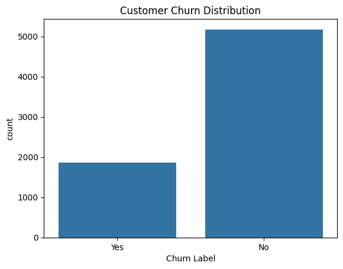
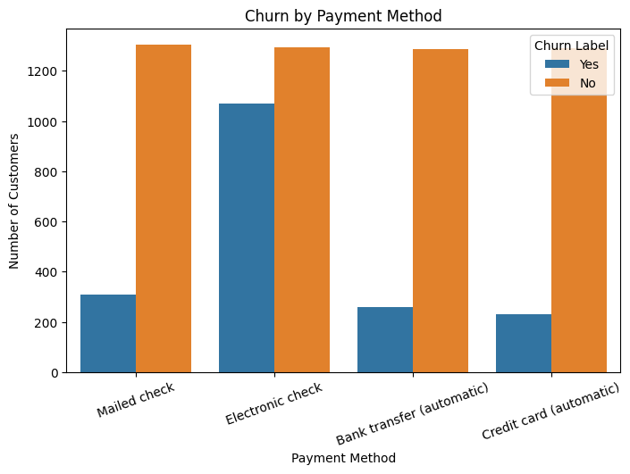
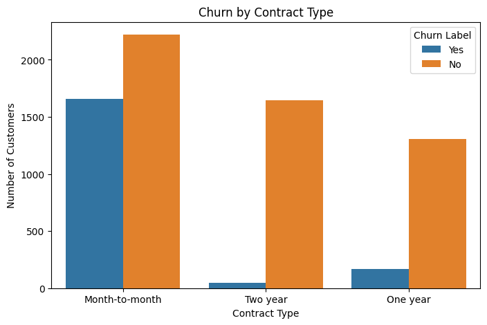
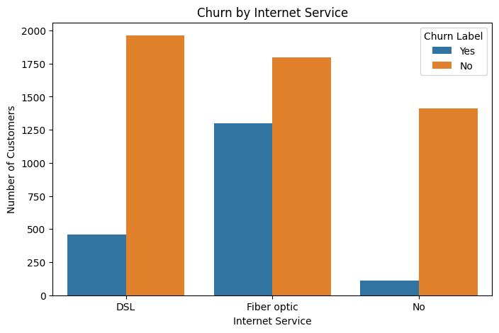
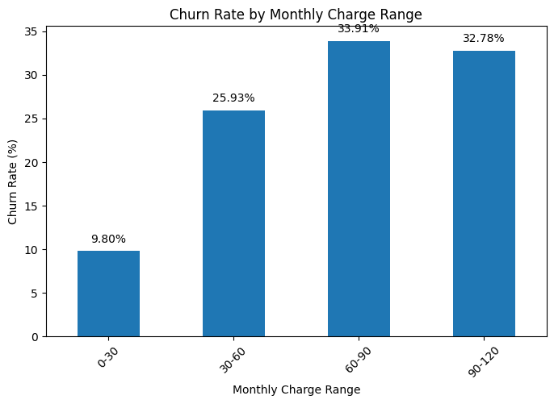
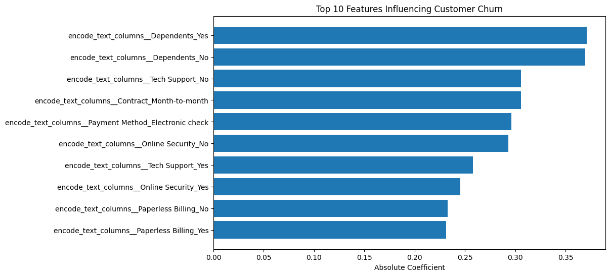

# customer-churn-prediction
Customer Churn Prediction | Machine Learning, FastAPI & Docker

## Run with Docker

bash
docker build -t churn-api .

docker run -p 8000:8000 churn-api

open:
[http://0.0.0.0:8000/docs](http://localhost:8000/docs)

# Customer Churn Prediction

## Business Problem

Customer churn is a major challenge for subscription-based businesses. This project aims to predict whether a customer is likely to leave a telecom company using machine learning techniques.

## Dataset

Telco Customer Churn Dataset

- 7,043 customers
- 23 features
- Binary target variable: Churn

## Exploratory Data Analysis

## Churn Distribution

## Payment Method vs Churn

Key findings:

- Customers on month-to-month contracts have significantly higher churn rates.
- Electronic Check users exhibit the highest churn rate (45.29%).
- Customers without technical support are more likely to churn.
- Customers without online security services are more likely to leave.
- Customers without dependents show increased churn risk.

## Models Evaluated

| Model | Accuracy | Recall | F1 | ROC-AUC |
|---------|---------:|---------:|---------:|---------:|
| Logistic Regression | 0.8041 | 0.5668 | 0.6057 | 0.8454 |
| Random Forest | 0.7913 | 0.4840 | 0.5518 | 0.8316 |
| XGBoost | 0.7736 | 0.4947 | 0.5370 | 0.8286 |

## Best Model

Logistic Regression achieved the best overall performance with a ROC-AUC score of **0.8454**..

## Feature Importance

## Key Business Recommendations

- Convert month-to-month customers into long-term contracts.
- Promote automatic payment methods.
- Encourage adoption of technical support services.
- Bundle online security with internet plans.
- Design retention campaigns for high-risk customer segments.

## Tech Stack

- Python
- Pandas
- NumPy
- Scikit-learn
- XGBoost
- Matplotlib
- Seaborn
